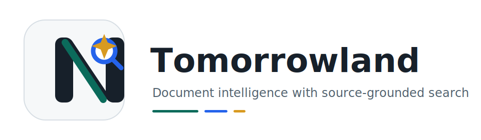
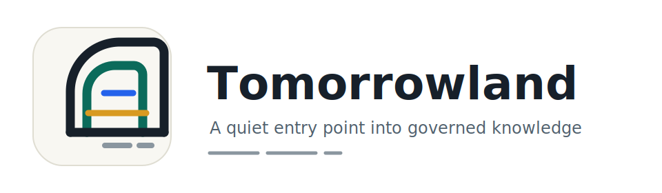

# Tomorrowland Logo Options

These are review candidates for the user-facing Tomorrowland UI. The final logo
should be chosen before UI Phase 00 starts so the app shell, favicon, login
screen, and navigation rail use one consistent mark.

## Option A: Compass N

Best fit when the product should feel search-first, precise, and fast. The N
shape doubles as a compact app icon, while the compass/search point hints at
navigation through a private document corpus.

## Option B: Source Lattice

Best fit when the product should emphasize connected sources, citations, and
RAG evidence. This is the most literal document-intelligence direction.

## Option C: Horizon Gate

Best fit when the product should feel calmer and more institutional. It is less
technical, with a gateway metaphor for entering governed knowledge.

## Option D: Cyber Bike ✅ Active

Dark cyberpunk-inspired mark with a neon cyan/blue bicycle on a deep navy
background. The bicycle is the primary visual element, rendered with a glowing
HUD aesthetic, scanline overlay, and corner bracket accents. Asset:
`frontend/public/tomorrowland-logo-cyber-bike.svg` (also served at
`/tomorrowland-logo-cyber-bike.svg` in the app).

This is the current active product logo used in the nav rail, login page, and
as the app favicon.

## Recommendation

Option D (Cyber Bike) is the active product logo as of the branding update for
Issue #133. Options A–C are retained for historical reference.
